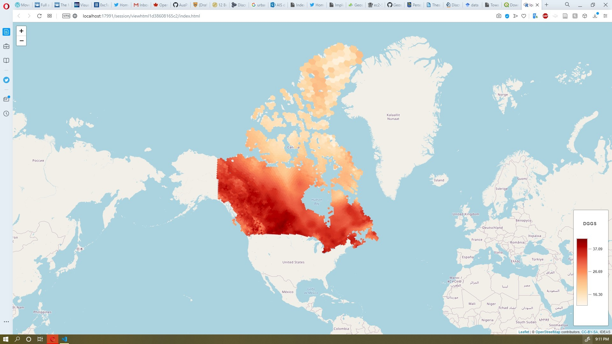

# `addContinuousDGGSLayer`: addContinuousDGGSLayer

## Description


 Adds a DGGS Continious Type layer.


## Usage

```r
addContinuousDGGSLayer(
  map,
  layer,
  tid = NULL,
  filter = NULL,
  layerId = NULL,
  group = NULL,
  options = dggsContinuousTileOptions()
)
```


## Arguments

Argument      |Description
------------- |----------------
```map```     |     a leaflet map
```layer```     |     the dataset name. it is the table name which has a dggid,key,tid,value structure in nz
```tid```     |     tid value.
```filter```     |     filter data, can be in a form of key='something', it is mostly an SQL where statement
```layerId```     |     the layerid same as leaflet layerid
```group```     |     groupid same as leaflet group id
```options```     |     legend options are 
|**colorScale** A colorscale. it can be a vector of hex colors of chromajs colorscales like OrRd,YlGnBu,RdYlBu,Spectral   
|**addSymbologyControl** Add Symbology controls to the legend, dafault is true  
|**disableOpacityControl** show/hide opacity control in the legend

## Value


 leaflerR map object


## Examples


```r

m <- leaflet() %>%\
leaflet::setView(lng=-106.34, lat=56.13,zoom = 2)%>%
addMarkers(lng=-106.34, lat=56.13, popup=\"Canada")
continuousLayerOptions <- list(colorScale=c("OrRd"))
m %>%
addContinuousDGGSLayer(layer="ANUSPLINE3",tid='1950',filter="key='MAX_TEMP'",group="nominalLayer",options = continuousLayerOptions)
```

 