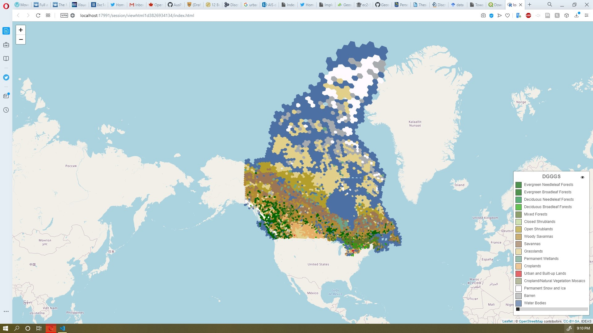

# `addNominalDGGSLayer`: addNominalDGGSLayer

## Description


 Adds a DGGS Nominal Type layer.


## Usage

```r
addNominalDGGSLayer(
  map,
  layer,
  tid = NULL,
  filter = NULL,
  layerId = NULL,
  group = NULL,
  options = dggsNominalTileOptions()
)
```


## Arguments

Argument      |Description
------------- |----------------
```map```     |     a leaflet map
```layer```     |     the dataset name. it is the table name which has a dggid,key,tid,value structure in nz
```tid```     |     tid value.
```filter```     |     filter data, can be in a form of key='something', it is mostly an SQL where statement
```layerId```     |     the layerid same as leaflet layerid
```group```     |     groupid same as leaflet group id
```options```     |     The mandetory option for this type of the layer is classNames which is a 3dimentional list in this format c("Lable",value,"HexColor") legend options are 
|**defaultColor** Color that shows as default value when a key is not defined. A hex color and default is '#FFF'   
|**addSymbologyControl** Add Symbology controls to the legend, dafault is true  
|**classNames** A list of c("Lable",value,"HexColor"), its mandatory  
|**disableOpacityControl** show/hide opacity control in the legend

## Value


 leaflerR map object


## Examples

```r

m <- leaflet() %>%
leaflet::setView(lng=-106.34, lat=56.13,zoom = 2)%>%
addMarkers(lng=-106.34, lat=56.13, popup="Canada")
nominalLayerOptions <-list(
   classNames=list(
     c("Evergreen Needleleaf Forests",1,"#006300"),
     c("Evergreen Broadleaf Forests", 2,"#006300"),
     c("Deciduous Needleleaf Forests", 3,"#148c3d"),
     c("Deciduous Broadleaf Forests", 4,"#1eab05"),
     c("Mixed Forests", 5,"#5c752b"),
     c("Closed Shrublands", 6,"#bad48f"),
     c("Open Shrublands", 7,"#b39e2b"),
     c("Woody Savannas", 8,"#b38a33"),
     c("Savannas", 9,"#9c7554"),
     c("Grasslands", 10,"#e1cf8a"),
     c("Permanent Wetlands", 11,"#6ba38a"),
     c("Croplands", 12,"#e6ae66"),
     c("Urban and Built-up Lands", 13,"#dc2126"),
     c("Cropland/Natural Vegetation Mosaics", 14,"#949c70"),
     c("Permanent Snow and Ice", 15,"#fffaff"),
     c("Barren", 16,"#a8abae"),
     c("Water Bodies", 17,"#4c70a3")

  ))


m%>%
addNominalDGGSLayer(layer="MOD12Q1DATA",tid='2003',filter="key='MOD12Q1'",group="continuousLayer",options = nominalLayerOptions)
```


