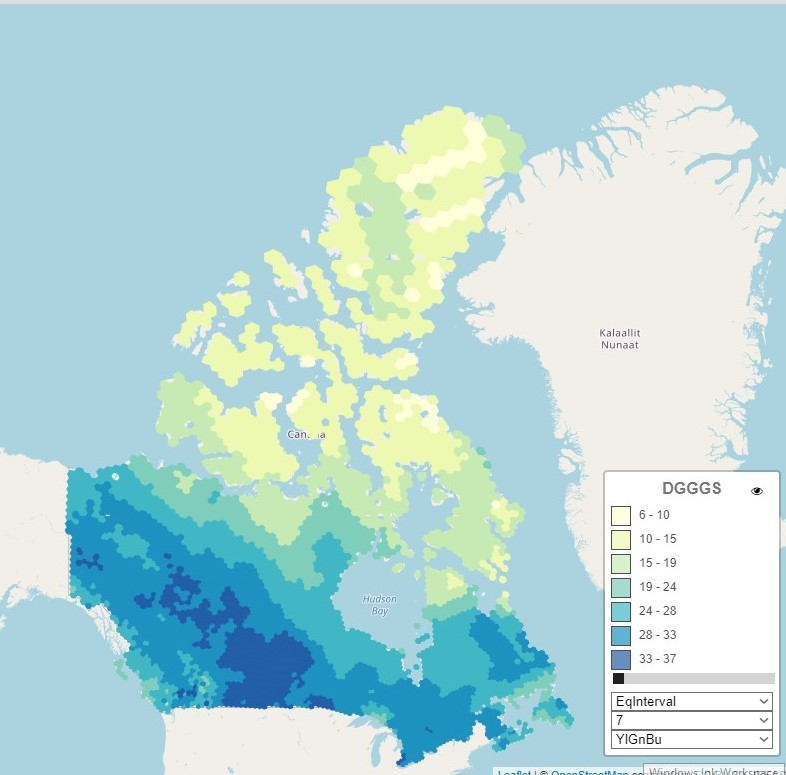
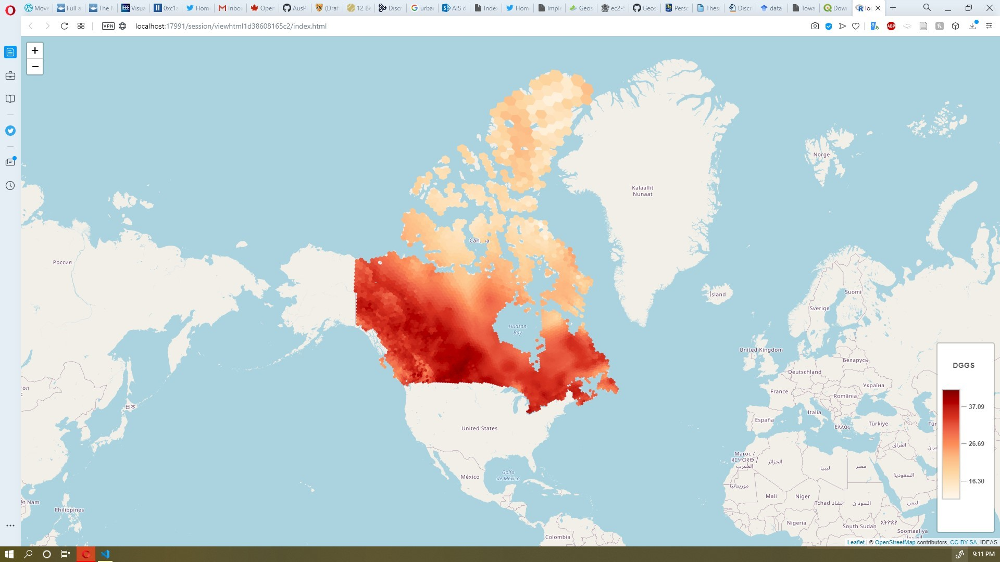

# Installing

Documentations of IDEAS DGGS rendering package render spatial data.


[](https://travis-ci.com/thespatiallabatLaurier/dggslayer) [](https://dggslayer.readthedocs.io/en/latest/?badge=latest)




# Documentations


```
https://rdrr.io/github/thespatiallabatLaurier/dggslayer/
https://dggslayer.readthedocs.io/en/latest/
```

# Install

```r
devtools::install_github("thespatiallabatLaurier/dggslayer")

```

# Examples

**addNumericalDGGSLayer**
```r

m <- leaflet() %>%
leaflet::setView(lng=-106.34, lat=56.13,zoom = 2)%>%
addMarkers(lng=-106.34, lat=56.13, popup="Canada")
continuousLayerOptions <- list(colorScale=c("OrRd"))
m %>%
addNumericalDGGSLayer(layer="ANUSPLINE3",tid='1950',filter="key='MAX_TEMP'",group="nominalLayer",options = continuousLayerOptions)
```
  


**addNominalDGGSLayer**
```r

m <- leaflet() %>%
leaflet::setView(lng=-106.34, lat=56.13,zoom = 2)%>%
addMarkers(lng=-106.34, lat=56.13, popup="Canada")
nominalLayerOptions <-list(
   classNames=list(
     c("Evergreen Needleleaf Forests",1,"#006300"),
     c("Evergreen Broadleaf Forests", 2,"#006300"),
     c("Deciduous Needleleaf Forests", 3,"#148c3d"),
     c("Deciduous Broadleaf Forests", 4,"#1eab05"),
     c("Mixed Forests", 5,"#5c752b"),
     c("Closed Shrublands", 6,"#bad48f"),
     c("Open Shrublands", 7,"#b39e2b"),
     c("Woody Savannas", 8,"#b38a33"),
     c("Savannas", 9,"#9c7554"),
     c("Grasslands", 10,"#e1cf8a"),
     c("Permanent Wetlands", 11,"#6ba38a"),
     c("Croplands", 12,"#e6ae66"),
     c("Urban and Built-up Lands", 13,"#dc2126"),
     c("Cropland/Natural Vegetation Mosaics", 14,"#949c70"),
     c("Permanent Snow and Ice", 15,"#fffaff"),
     c("Barren", 16,"#a8abae"),
     c("Water Bodies", 17,"#4c70a3")

  ))


m%>%
addNominalDGGSLayer(layer="MOD12Q1DATA",tid='2003',filter="key='MOD12Q1'",group="continuousLayer",options = nominalLayerOptions)
```


**addContinuousDGGSLayer**

```r

m <- leaflet() %>%\
leaflet::setView(lng=-106.34, lat=56.13,zoom = 2)%>%
addMarkers(lng=-106.34, lat=56.13, popup=\"Canada")
continuousLayerOptions <- list(colorScale=c("OrRd"))
m %>%
addContinuousDGGSLayer(layer="ANUSPLINE3",tid='1950',filter="key='MAX_TEMP'",group="nominalLayer",options = continuousLayerOptions)
```

 


